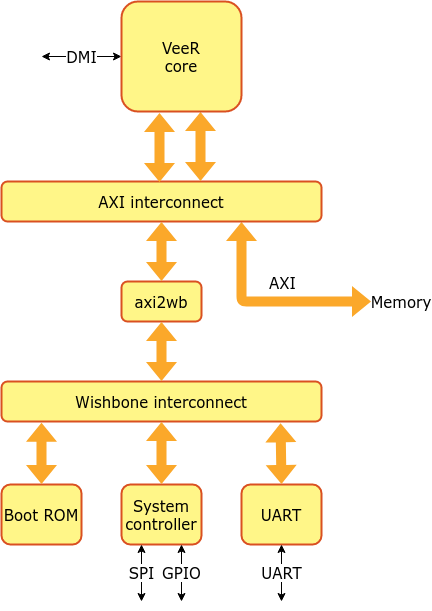
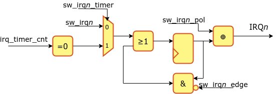
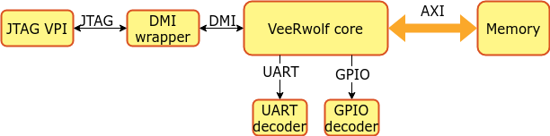
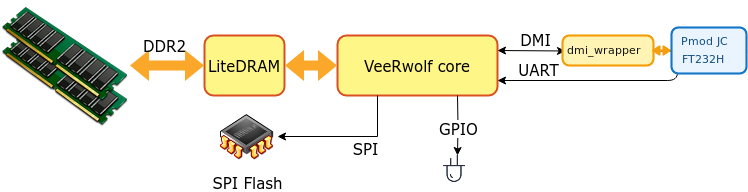
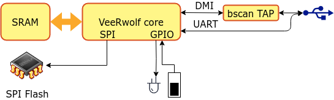

VeeRwolf
========

This revision uses the `alphijiang` EH1/EL2/EH2 core forks. EH2 hardware
configuration is generated from `configs/veer.config` through the
`veerwolf.core` board profile; the official EH2 VLNV is `VeeR_EH2:1.4`.

VeeRwolf is a [FuseSoC](https://github.com/olofk/fusesoc)-based reference platform for the VeeR family of RISC-V cores. The EH1, EL2 and EH2 providers use the maintained forks [Cores-VeeR-EH1](https://github.com/alphijiang/Cores-VeeR-EH1), [Cores-VeeR-EL2](https://github.com/alphijiang/Cores-VeeR-EL2) and [Cores-VeeR-EH2](https://github.com/alphijiang/Cores-VeeR-EH2). This integration adds board-specific EH2 profiles while preserving the upstream VeeRwolf target and flag workflow. See [CPU configuration](#cpu-configuration) to learn how to switch between them.

This can be used to run the [RISC-V compliance tests](https://github.com/riscv/riscv-compliance), [Zephyr OS](https://www.zephyrproject.org), [TockOS](https://github.com/tock/tock/tree/master/boards/swervolf) or other software in simulators or on FPGA boards. Focus is on portability, extendability and ease of use; to allow VeeR users to quickly get software running, modify the SoC to their needs or port it to new target devices.

This project was previously called SweRVolf. The last released version using the old name is v0.7.5

# Structure

To ease portability, the SoC consists of a portable technology-agnostic core with target-specific wrappers. This chapter describes the functionality of the core and the technology-specific targets.

## VeeRwolf Core

The core of VeeRwolf consists of the VeeR CPU with a boot ROM, AXI4 interconnect, UART, SPI, RISC-V timer and GPIO. The core doesn't include any RAM but instead exposes a memory bus that the target-specific wrapper will connect to an appropriate memory controller. Other external connections are clock, reset, UART, GPIO, SPI and DMI (Debug Module Interface).

*VeeRwolf Core*

### Memory map

| Core     | Address               |
| -------- | --------------------- |
| RAM      | 0x00000000-0x07FFFFFF |
| Boot ROM | 0x80000000-0x80000FFF |
| syscon   | 0x80001000-0x80001FFF |
| UART     | 0x80002000-0x80002FFF |

#### RAM

The VeeRwolf core does not contain a memory controller but allocates the first 128MiB of the address for RAM that can be used by a target application and exposes an AXI bus to the wrapper.

#### Boot ROM

The boot ROM contains a first-stage bootloader. After system reset, VeeR will start fetching its first instructions from this area.

To select a bootloader, set the `bootrom_file` parameter. See the [Booting](#booting) chapter for more information about available bootloaders.

#### System controller

The system controller contains common system functionality such as keeping register with the SoC version information, RAM initialization status and the RISC-V machine timer. Below is the memory map of the system controller

| Address  | Register              | Description |
| -------- | --------------------- | -----------
| 0x00     | version_patch | VeeRwolf patch version |
| 0x01     | version_minor | VeeRwolf minor version |
| 0x02     | version_major |VeeRwolf major version |
| 0x03     | version_misc | Bit 7 is set when VeeRwolf was built from modified sources |
|          |              | Bit 6:0 revision since last patch version |
| 0x04-0x07     | version_sha | SHA hash of the build
| 0x08     | sim_print | Outputs a character in simulation. No effect on hardware
| 0x09     | sim_exit | Exits a simulation. No effect on hardware
| 0x0A     | init_status | Bit 0 = RAM initialization complete. Bit 1 = RAM initialization reported errors
| 0x0B     | sw_irq                | Software-controlled external interrupts
| 0x0C-0x0F | nmi_vec | Interrupt vector for NMI |
| 0x10-0x13 | gpio0 | 32 readable and writable GPIO bits |
| 0x18-0x1B | gpio1 | 32 readable and writable GPIO bits |
| 0x20-0x27 | mtime | mtime from RISC-V privilege spec |
| 0x28-0x2f | mtimecmp |mtimecmp from RISC-V privilege spec |
| 0x30-0x33 | irq_timer_cnt | IRQ timer counter |
| 0x34      | irq_timer_ctrl | IRQ timer control |
| 0x3C-0x3F | clk_freq_hz | Clock frequency of main clock in Hz |
| 0x40     | SPI_SPCR | Simple SPI Control register |
| 0x48     | SPI_SPSR | Simple SPI status register |
| 0x50     | SPI_SPDR | Simple SPI data register |
| 0x58     | SPI_SPER | Simple SPI extended register |
| 0x60     | SPI_SPSS | Simple SPI slave select register |

##### syscon_base+0x000B sw_irq

This register allows configuration and assertion of IRQ line 3 and 4, for testing the VeeR PIC or having two extra software-controllable interrupt sources. Interrupts can be triggered by writing to the sw_irq*n* bits when the timer bit is set to 0, or by a timeout of the irq_timer, when the timer bit is set to one. If both sw_irq3_timer and sw_irq4_timer are set to 0, the IRQ timer instead asserts an NMI when it reaches 0.

If sw_irq3_timer or sw_irq4_timer are asserted, the interrupt trigger is connected to

| Bits | Name         | Description |
| ---- | ------------ | -----------
|    7 | sw_irq4      | Trigger IRQ line 4
|    6 | sw_irq4_edge | 0 = IRQ4 is asserted until sw_irq4 is cleared, 1 = Writing to sw_irq4 only asserts IRQ4 for one clock cycle
|    5 | sw_irq4_pol  | IRQ4 polarity. 0 = Active high, 1 = active low
|    4 | sw_irq4_timer| 0 = IRQ4 is triggered by sw_irq4, 1 = IRQ4 is triggered by irq_timer timeout
|    3 | sw_irq3      | Trigger IRQ line 3
|    2 | sw_irq3_edge | 0 = IRQ3 is asserted until sw_irq3 is cleared, 1 = Writing to sw_irq3 only asserts IRQ3 for one clock cycle
|    1 | sw_irq3_pol  | IRQ3 polarity. 0 = Active high, 1 = active low
|    0 | sw_irq3_timer| 0 = IRQ3 is triggered by sw_irq3, 1 = IRQ3 is triggered by irq_timer timeout

##### syscon_base+0x0030 irq_timer_cnt

Set or read the IRQ timer counter value. Granularity is in system clock frequency cycles.

##### syscon_base+0x0034 irq_timer_en

Bit 0 enables or disables one-shot IRQ countdown timer. Automatically disables itself when reaching zero

#### UART

VeeRwolf contains a ns16550-compatible UART

## VeeRwolf sim

VeeRwolf sim is a simulation target that wraps the VeeRwolf core in a testbench to be used by verilator or event-driven simulators such as QuestaSim. It can be used for full-system simulations that executes programs running on VeeR. It also supports connecting a debugger through OpenOCD and JTAG VPI. The [Debugging](#debugging) chapter contains more information on how to connect a debugger.

*VeeRwolf Simulation target*

The simulation target exposes a number of parameters for compile-time and run-time configuration. These parameters are all exposed as FuseSoC parameters. The most relevant parameters are:

* `--jtag_vpi_enable` : Enables the JTAG server which OpenOCD can connect to
* `--ram_init_file` : Loads a Verilog hex file to use as initial on-chip RAM contents
* `--vcd` : Enable VCD dumping

Memory files suitable for loading with `--ram_init_file` can be created from binary files with the `sw/makehex.py` script

## VeeRwolf Nexys

VeeRwolf Nexys is a version of the VeeRwolf SoC created for the Digilent Nexys A7 board. It uses the on-board 128MB DDR2 for RAM, has GPIO connected to LED, supports booting from SPI Flash and uses the microUSB port for UART and FPGA programming. In this integration, CPU debug JTAG is exposed on Pmod JC for EH1, EH2 and EL2 through the official Cores-VeeR `dmi_wrapper`. The default bootloader for the VeeRwolf Nexys target will attempt to load a program stored in SPI Flash by default.

*VeeRwolf Nexys A7 target*

### I/O

The active I/O consists of LEDs, switches, the microUSB connector for UART,
FPGA programming and power, plus Pmod JC for external CPU debug JTAG.

#### LEDs

16 LEDs are controlled by memory-mapped GPIO at address 0x80001010-0x80001011

#### Switches

16 Switches are mapped GPIO addresses at 0x80001012-0x80001013

During boot up, the two topmost switches (sw14, sw15) control the boot mode.

| sw15 | sw14 | Boot mode                  |
| ---- | ---- | -------------------------- |
|  off |  off | Boot from SPI Flash        |
|  off |   on | Boot from serial           |
|   on |  off | Boot from address 0 in RAM |
|   on |   on | Boot from ICCM at `0xEE000000` |

*Note: Switch 0 has a dual purpose and selects whether to output serial communication from the SoC (0=off) or from the embedded self-test program in the DDR2 controller (1=on).*

#### micro USB

The microUSB port provides UART, FPGA programming and board power. The serial
port appears as `/dev/ttyUSB0`, `/dev/ttyUSB1` or similar; a terminal emulator
can connect at 115200 baud. CPU debug does not use the on-board BSCAN tunnel in
this integration; connect the external FT232H to Pmod JC as described in the
[debugging](#debugging) chapter.

#### SPI Flash

An SPI controller is connected to the on-board SPI Flash. This can be used for storing data such as program to be loaded into memory during boot. The [SPI uImage loader](#spi-uimage-loader) chapter goes into more detail on how to prepare, write and boot a program stored in SPI Flash

## VeeRwolf Basys 3

VeeRwolf Basys 3 is a version of the VeeRwolf SoC created for the Digilent Basys 3 board. It uses 64kB on-chip memory for RAM, has GPIO connected to LEDs and switches, supports booting from SPI Flash and uses the microUSB port for UART and JTAG communication. The default bootloader for the VeeRwolf Basys 3 target will attempt to load a program stored in SPI Flash by default.

*VeeRwolf Basys 3 target*

### I/O

The active on-board I/O consists of LEDs, switches and the microUSB connector for UART, JTAG and power.

#### LEDs

16 LEDs are controlled by memory-mapped GPIO at address 0x80001010-0x80001011

#### Switches

16 Switches are mapped GPIO addresses at 0x80001012-0x80001013

During boot up, the two topmost switches (sw14, sw15) control the boot mode.

| sw15 | sw14 | Boot mode                  |
| ---- | ---- | -------------------------- |
|  off |  off | Boot from SPI Flash        |
|  off |   on | Boot from serial           |
|   on |  off | Boot from address 0 in RAM |
|   on |   on | Boot from ICCM at `0xEE000000` |

#### micro USB

UART and JTAG communication is tunneled through the microUSB port on the board and will appear as `/dev/ttyUSB0`, `/dev/ttyUSB1` or similar depending on OS configuration. A terminal emulator can be used to connect to the UART (e.g. by running `screen /dev/ttyUSB0 115200`) and OpenOCD can connect to the JTAG port to program the FPGA or connect the debug proxy. The [debugging](#debugging) chapter goes into more detail on how to connect a debugger.

#### SPI Flash

An SPI controller is connected to the on-board SPI Flash. This can be used for storing data such as program to be loaded into memory during boot. The [SPI uImage loader](#spi-uimage-loader) chapter goes into more detail on how to prepare, write and boot a program stored in SPI Flash

## VeeRwolf Genesys

VeeRwolf Genesys is a version of the VeeRwolf SoC created for the Digilent Genesys2 board. It uses the on-board 1GB DDR3 for RAM, has GPIO connected to LED, supports booting from SPI Flash and uses the microUSB port for UART and FPGA programming. In this integration, CPU debug JTAG is exposed on Pmod JC for EH1, EH2 and EL2 through the official Cores-VeeR `dmi_wrapper`. The default bootloader for the VeeRwolf Nexys target will attempt to load a program stored in SPI Flash by default.

*VeeRwolf Genesys K7 target*

### I/O

The active I/O consists of LEDs, switches, the microUSB connector for UART,
FPGA programming and power, plus Pmod JC for external CPU debug JTAG.

#### LEDs

16 LEDs are controlled by memory-mapped GPIO at address 0x80001010-0x80001011

#### Switches

16 Switches are mapped GPIO addresses at 0x80001012-0x80001013

During boot up, the two topmost switches (sw14, sw15) control the boot mode.

| sw15 | sw14 | Boot mode                  |
| ---- | ---- | -------------------------- |
|  off |  off | Boot from SPI Flash        |
|  off |   on | Boot from serial           |
|   on |  off | Boot from address 0 in RAM |
|   on |   on | Boot from ICCM at `0xEE000000` |

*Note: Switch 0 has a dual purpose and selects whether to output serial communication from the SoC (0=off) or from the embedded self-test program in the DDR2 controller (1=on).*

#### micro USB

The microUSB port provides UART, FPGA programming and board power. The serial
port appears as `/dev/ttyUSB0`, `/dev/ttyUSB1` or similar; a terminal emulator
can connect at 115200 baud. CPU debug does not use the on-board BSCAN tunnel in
this integration; connect the external FT232H to Pmod JC as described in the
[debugging](#debugging) chapter.

#### SPI Flash

An SPI controller is connected to the on-board SPI Flash. This can be used for storing data such as program to be loaded into memory during boot. The [SPI uImage loader](#spi-uimage-loader) chapter goes into more detail on how to prepare, write and boot a program stored in SPI Flash

# How to use

## Prerequisites

Install [verilator](https://www.veripool.org/wiki/verilator)

Create an empty directory, e.g. named veerwolf, to use as the root of the project. This directory will from now on be called `$WORKSPACE`. All further commands will be run from `$WORKSPACE` unless otherwise stated. After entering the workspace directory, run `export WORKSPACE=$(pwd)` to set the $WORKSPACE shell variable.

1. Make sure you have [FuseSoC](https://github.com/olofk/fusesoc) version 1.12 or newer installed or install it with `pip install fusesoc`
2. Add the FuseSoC base library to the workspace with `fusesoc library add fusesoc-cores https://github.com/fusesoc/fusesoc-cores`
3. Add the veerwolf library with `fusesoc library add veerwolf https://github.com/alphijiang/VeeRwolf-MIG`
4. Make sure you have verilator installed to run the simulation. **Note** This requires at least version 3.918. The version that is shipped with Ubuntu 18.04 will NOT work

Your workspace shall now look like this:

    $WORKSPACE
    └──fusesoc_libraries
       ├──fusesoc-cores
       └──veerwolf

After step 3, the VeeRwolf sources will be located in `$WORKSPACE/fusesoc_libraries/veerwolf`. For convenience, this directory will from now on be refered to as `$VEERWOLF_ROOT`. Run `export VEERWOLF_ROOT=$WORKSPACE/fusesoc_libraries/veerwolf` to set this as a shell variable

Install [Zephyr SDK](https://github.com/zephyrproject-rtos/sdk-ng/tags)

In order to  build zephyr application the zephyr SDK must be installed.  Attempting to build with west build will tell you which version is needed (if not already installed).  It is probably best to go with the oldest recommended version, since it is possible to fail by using a too new SDK (e.g. a compiler that needs options the build system (which is part of the OS release, not the SDK) does not yet know how to provide).

Different versions of the zephyr SDK can be found at (https://github.com/zephyrproject-rtos/sdk-ng/tags).  Installation details differ between the versions, but tend to be either a self-contained installer script (e.g. zephyr-sdk-0.13.2-linux-aarch64-setup.run that is applied by

chmod a+x zephyr-sdk-0.13.2-linux-aarch64-setup.run

./zephyr-sdk-0.13.2-linux-aarch64-setup.run

or an archive with an installer script (e.g. zephyr-sdk-0.16.1_linux-x86_64_minimal.tar.xz) which needs to be extracted and the installer run by
tar xvf zephyr-sdk-0.16.1_linux-x86_64_minimal.tar.xz
cd zephyr-sdk-0.16.1
./setup.sh

Install [Vivado](https://www.xilinx.com/support/download/index.html/content/xilinx/en/downloadNav/vivado-design-tools)

Vivado is needed to synthesize the design for the nexys A7 target.  The standard edition is available free of charge from Xilinx/AMD, but the user needs to register and fill out an export license form.  A good place to start is probably https://www.xilinx.com/support/download/index.html/content/xilinx/en/downloadNav/vivado-design-tools.html.  Someone doing this for the first time can probably expand on these notes, I already had a registered xilinx user so probably short-circuited part of the process.

## Running the SoC

The VeeRwolf SoC can be run in simulation or on hardware (Digilent Nexys A7 currently supported). In either case FuseSoC is used to launch the simulation or build and run the FPGA build. To select what to run, use the `fusesoc run` command with the `--target` parameter. To run in simulation use

    fusesoc run --target=sim veerwolf

This will load a small example program that prints a string and exits. If you want to rerun the program without rebuilding the simulation model, you can add the --run parameter

    fusesoc run --target=sim --run veerwolf

To build (and optionally program) an image for a Nexys A7 board, run

    fusesoc run --target=nexys_a7 veerwolf

All targets support different compile- and run-time options. To see all options for a target run

    fusesoc run --target=$TARGET veerwolf --help

To list all available targets, run

    fusesoc core show veerwolf

To build and run on Riviera-Pro simulator

    fusesoc run --target=sim --tool=rivierapro veerwolf

After building any of the targets, there will now be a `build` in your workspace. This directory contains everything needed to rebuild the target. It can be safely removed and gets rebuilt when building a target again. To use a different build directory, pass `--build-root=<output dir>` to the run arguments.

### Run a precompiled example in simulation

In simulation, VeeRwolf supports preloading an application to memory with the `--ram_init_file` parameter. VeeRwolf comes bundled with some example applications in the `sw` directory.

To build the simulation model and run the bundled Zephyr Hello world example in a simulator. `fusesoc run --target=sim veerwolf --ram_init_file=$VEERWOLF_ROOT/sw/zephyr_hello.vh`.
To build and run this example on Riviera-Pro: `fusesoc run --target=sim --tool=rivierapro veerwolf --ram_init_file=$VEERWOLF_ROOT/sw/zephyr_hello.vh`.

After running the above command, the simulation model should be built and run. At the end it will output

    Releasing reset
    ***** Booting Zephyr OS zephyr-v1.14.0 *****
    Hello World! veerwolf_nexys

At this point the simulation can be aborted with `Ctrl-C`.

Another example to run is the Zephyr philosophers demo.

    fusesoc run --run --target=sim veerwolf --ram_init_file=$VEERWOLF_ROOT/sw/zephyr_philosophers.vh

* Note the `--run` option which will prevent rebuilding the simulator model

### Run RISC-V compliance tests

**Note:** The following instructions are valid for version 1.0 of the RISC-V compliance tests. The target-specific support for VeeRwolf has not yet been ported to newer versions.

1. Build the simulation model, if that hasn't already been done, with `fusesoc run --target=sim --setup --build veerwolf`
2. Download the RISC-V compliance tests to the workspace with `git clone https://github.com/riscv/riscv-compliance --branch 1.0`. Your directory structure should now look like this:

        $WORKSPACE
        ├──build
        ├──fusesoc_libraries
        └──riscv-compliance

3. Enter the riscv-compliance directory and run `make TARGETDIR=$VEERWOLF_ROOT/riscv-target RISCV_TARGET=veer RISCV_DEVICE=rv32i RISCV_ISA=rv32i TARGET_SIM=$WORKSPACE/build/veerwolf_0.7.5/sim-verilator/Vveerwolf_core_tb`

*Note: Other test suites can be run by replacing RISCV_ISA=rv32imc with rv32im or rv32i*

*Note: The `TARGET_SIM` path needs to be updated to reflect the actual location of `Vveerwolf_core_tb`*

### Run on hardware

The VeeRwolf SoC can be built for a Digilent Nexys A7 board with

    fusesoc run --target=nexys_a7 veerwolf

If the board is connected, it will automatically be programmed when the FPGA image has been built. It can also be programmed manually afterwards by running `fusesoc run --target=nexys_a7 --run veerwolf` or running OpenOCD as described in the debugging chapter.

The default bootloader will boot from SPI Flash, RAM or serial depending on the boot mode set by the switches. The default bootloader can be replaced with the `--bootrom_file` parameter. Note that the boot ROM is not connected to the data port, so it can only execute instructions. Data can not be read or written to this segment. The below example will compile the memtest application and use that as boot ROM instead.

    make -C ../$VEERWOLF_ROOT/sw memtest.vh
    fusesoc run --target=nexys_a7 veerwolf --bootrom_file=$VEERWOLF_ROOT/sw/memtest.vh

## Build Zephyr applications

        $WORKSPACE
        ├──fusesoc_libraries
        ├──...
        └──zephyr

1.Create a West (Zephyr's build tool) workspace in the same directory as the FuseSoC workspace by running
    west init
2. Add the VeeRwolf-specific drivers and BSP with

    west config manifest.path fusesoc_libraries/veerwolf
    west update

   The workspace should now look like this

        $WORKSPACE
        ├──fusesoc_libraries
        |  ├──...
        |  └──veerwolf
        ├──...
        └──zephyr

3. Enter the directory of the application to build. Zephyr comes with a number of example applications in the samples directory (`$WORKSPACE/zephyr/samples`), e.g. `$WORKSPACE/zephyr/samples/basic/blinky` contains the Zephyr blinky example. From now on, the program to build and run will be called `$APP`
4. Build the code with `west build -b veerwolf_nexys`

After building the code there will now be an executable .elf file in `build/zephyr/zephyr.elf` and a binary file in `build/zephyr/zephyr.bin`. The executable file can be loaded into VeeRwolf with a debugger and the binary file can be further converted and loaded into RAM for simulations.

To load the .elf file with a debugger, see [Loading programs with OpenOCD](#loading-programs-with-openocd)

To use the .bin file in a simulator, it must first be converted into a suitable verilog hex file. From the directory where the application was built, run
    `python3 $VEERWOLF_ROOT/sw/makehex.py build/zephyr/zephyr.bin > $WORKSPACE/$APP.hex` to create a hex file in the workspace directory. This can now be loaded into a simulator with

    fusesoc run --target=sim veerwolf --ram_init_file=$APP.hex

The VeeRwolf demo application in `$VEERWOLF_ROOT/sw/veerwolf_zephyr_demo` is also a Zephyr program and can be built in the same way

## Debugging

VeeRwolf supports debugging both on hardware and in simulation. There are different procedures on how to connect the debugger, but once connected, the same commands can be used (although it's a lot slower in simulations).

### Prerequisites

Install the [alphijiang OpenOCD fork](https://github.com/alphijiang/openocd).
This version contains the EH2 ICCM abstract-memory changes used by this
project, including 8-, 16- and 32-bit ICCM reads and writes:

    git clone https://github.com/alphijiang/openocd.git
    cd openocd
    ./bootstrap
    ./configure --enable-jtag_vpi --enable-ftdi
    make
    sudo make install

The ICCM width adaptation is implemented in OpenOCD; it does not change the
EH2 ICCM RTL interface. Subword debug access is required when GDB, Eclipse or
another IDE inserts, reads back and restores software breakpoints, especially
2-byte breakpoints for compressed instructions. Hardware breakpoints continue
to use the EH2 trigger units and do not modify ICCM contents.

### Connecting debugger to simulation

When a VeeRwolf simulation is launched with the `--jtag_vpi_enable`, it will start a JTAG server waiting for a client to connect and send JTAG commands.

    fusesoc run --target=sim veerwolf --jtag_vpi_enable

After compilation, the simulation should now say

    Listening on port 5555

This means that it's ready to accept a JTAG client.

Open a new terminal, navigate to the workspace directory and run `openocd -f $VEERWOLF_ROOT/data/veerwolf_sim.cfg` to connect OpenOCD to the simulation instance. If successful, OpenOCD should output

    Info : only one transport option; autoselect 'jtag'
    Info : Set server port to 5555
    Info : Set server address to 127.0.0.1
    Info : Connection to 127.0.0.1 : 5555 succeed
    Info : This adapter doesn't support configurable speed
    Info : JTAG tap: riscv.cpu tap/device found: 0x00000001 (mfg: 0x000 (<invalid>), part: 0x0000, ver: 0x0)
    Info : datacount=2 progbufsize=0
    Warn : We won't be able to execute fence instructions on this target. Memory may not always appear consistent. (progbufsize=0, impebreak=0)
    Info : Examined RISC-V core; found 1 harts
    Info :  hart 0: XLEN=32, misa=0x40001104
    Info : Listening on port 3333 for gdb connections
    Info : Listening on port 6666 for tcl connections
    Info : Listening on port 4444 for telnet connections

and the simulation should report

    Waiting for client connection...ok
    Preloading TOP.veerwolf_core_tb.veerwolf.bootrom.ram from jumptoram.vh
    Releasing reset

Open a third terminal and connect to the debug session through OpenOCD with `telnet localhost 4444`. From this terminal, it is now possible to view and control the state of of the CPU and memory. Try this by running `mwb 0x80001010 1`. This will write to the GPIO register. To verify that it worked, there should now be a message from the simulation instance saying `gpio0 is on`. By writing 0 to the same register (`mwb 0x80001010 0`), the gpio will be turned off.

### Connecting debugger to Nexys A7

The on-board USB JTAG interface remains available for programming the FPGA. CPU
debug uses a separate FT232H MPSSE cable connected to Pmod JC for every CPU
selection on this modified Nexys target:

| FT232H | JTAG | Pmod JC |
| ------ | ---- | ------- |
| ADBUS0 | TCK  | JC1 |
| ADBUS1 | TDI  | JC2 |
| ADBUS2 | TDO  | JC3 |
| ADBUS3 | TMS  | JC4 |
| GND    | GND  | JC5 or JC11 |

Leave the FT232H VCC lead disconnected while the Nexys board is powered
normally. The detailed wiring diagram is available in
`docs/c232hm-nexys4-jtag-wiring.svg`.

Programming the FPGA through its on-board interface is unchanged:

    openocd -f $VEERWOLF_ROOT/data/veerwolf_nexys_program.cfg

EH2 uses the direct external debug configuration:

    openocd -f $VEERWOLF_ROOT/data/veerwolf_nexys_eh2_debug.cfg

The official EH2 1.4 Debug Module has `progbufsize=0`; this is an architectural
property, not a missing VeeRwolf RTL block. Use the
[alphijiang OpenOCD fork](https://github.com/alphijiang/openocd), whose EH2
abstract-memory implementation supports 8-, 16- and 32-bit ICCM reads and
writes. This allows GDB/Eclipse memory operations and software-breakpoint
insertion/restoration to work without adding an ICCM RTL width converter or a
Debug Module program buffer.

### Loading programs with OpenOCD

OpenOCD support loading ELF program files by running `load_image /path/to/file.elf`. Remember that the path is relative to the directory from where OpenOCD was launched.

After the program has been loaded, set the program counter to address zero with `reg pc 0` and run `resume` to start the program.

## Booting

VeeRwolf is set up by default to read its initial instructions from address
`0x80000000`, which points to the on-chip Boot ROM. The  bootloader
can continue from SPI Flash, UART serial loading, external RAM/DDR, or ICCM,
depending on GPIO bits 7:6 in register `0x80001013` (switches SW15:SW14).

| bit7 | bit6 | Boot mode         |
| ---- | ---- | ----------------- |
|    0 |    0 | SPI uImage loader |
|    0 |    1 | Serial boot       |
|    1 |    0 | Jump to RAM       |
|    1 |    1 | Jump to ICCM      |

### Jump to ICCM

ICCM boot jumps to `0xEE000000` without copying or validating an image. Load a
valid executable at that address before selecting this mode. EH1 and EH2 use
this ICCM base in their current configurations. A target configured with ICCM
disabled, including the current Nexys EL2 configuration, must not select this
mode.

### Jump to RAM

For simulations, the most common option is to load a program into the on-chip RAM and start executing from there. The default bootloader in such cases is a single instruction that jumps to address 0x0 and continues execution from there.

### SPI uImage loader

For most applications on real hardware it is preferred to store them in an on-board SPI Flash memory. The SPI uImage loader can read an image in the u-boot uImage format, copy it to RAM and start executing. This process requires creating a suitable image, writing it to Flash and set up the SPI uImage loader to read from the correct address in Flash.

#### Create a flash image

The `mkimage` tool available from u-boot is used to prepare an image to be written to Flash. `mkimage` expects a `.bin` file, which has been created with `iscv64-unknown-elf-objcopy -O binary`. Given a `$IMAGE.bin` we can now create `$IMAGE.ub` with the following command:

    mkimage -A riscv -C none -T standalone -a 0x0 -e 0x0 -n '' -d $IMAGE.bin $IMAGE.ub

Refer to the uimage manual for a description of each parameter. There are also Makefile targets in `$VEERWOLF_ROOT/sw/Makefile` that can be used as reference.

### Writing SPI Flash

#### Simulation

In order to test the SPI image loading mechanism in simulation, a specific FuseSoC target, `spi_tb` is available. If no run-time parameters are supplied it will load a prebuilt image containing the `hello` program (source available in `sw/hello.S`) from Flash, execute it and exit. This testbench will not work in Verilator as it uses a non synthesizable model of the SPI Flash. The default simulator is instead ModelSim. Other simulators can be used by adding the `--tool=$TOOL` argument to the command-line.

    fusesoc run --target=spi_tb veerwolf

The simulated Flash contents can be changed at compile-time with the `--flash_init_file` parameter. The model expects a uImage in verilog hex format. Such files can be created by running

    objcopy -I binary -O verilog $IMAGE.ub $IMAGE.hex

#### Nexys A7

For Nexys A7, OpenOCD is used to write to Flash. As the connection to the SPI Flash goes through the FPGA, this consists of a two-stage process where a proxy FPGA image is first written, which will handle communication between OpenOCD and the SPI Flash

1. Obtain the proxy FPGA image from [here](https://github.com/quartiq/bscan_spi_bitstreams/blob/master/bscan_spi_xc7a100t.bit) and place it in `$WORKSPACE`
2. Run `openocd -c "set BINFILE $IMAGE" -f $VEERWOLF_ROOT/data/veerwolf_nexys_write_flash.cfg`, where `$IMAGE` is the path to the uImage file that should be written to Flash

### Set up SPI uImage loader

The final step is to prepare the bootloader for VeeRwolf which will be responsible for reading the image from Flash, copy it to RAM and execute it. This process is the same for both simulation and hardware targets. Note that both the `spi_tb` target and `nexys_a7` target will have this as the default boot loader so in most cases nothing else needs to be done. There are however a couple of defines in `sw/spi_uimage_loader.S` that might need to be adjusted if the SPI controller is mapped to another base address or if the image is not stored at address 0 in the Flash.

### Serial boot

In serial boot mode, the UART waits for a program in Intel Hex format to be sent to the UART. Upon completion, the program will be launched.

## CPU configuration

VeeRwolf keeps the upstream EH1 default and the existing `--flag=cpu_el2`
selection. now adds EH2 only to the Nexys A7 target:

    fusesoc run --target=nexys_a7 --flag=cpu_eh2 veerwolf

Other official board targets retain their original EH1/EL2 selection and clock
configuration. The common Nexys top exposes external JTAG for all three cores;
all three official core packages provide the same `dmi_wrapper` interface.

For the Nexys A7 target, EH1 runs at 50 MHz, EL2 at 25 MHz and EH2 at 25 MHz.
The `clk_freq_hz` register in the system controller reports the selected
hardware clock, so UART and timer firmware can adapt at runtime.

### VeeR EH2  Nexys configuration

The EH2 configuration files are produced by the maintained
`alphijiang/Cores-VeeR-EH2` fork using its `configs/veer.config` script
(based on commit `ccf787a83e7e28267b172b50ef2de266c7d6ccac`). Its arguments are owned by
`veer_eh2_nexys4_config` in `veerwolf.core`. The initial board configuration
is:

| Resource | Address range | Size |
| -------- | ------------- | ---- |
| ICCM | `0xEE000000-0xEE00FFFF` | 64 KiB |
| DCCM | `0xF0040000-0xF0047FFF` | 32 KiB |
| Instruction cache | external executable regions | Disabled on Nexys A7 |
| PIC | `0xF00C0000` window | 128 sources |

The generated `cores/config/eh2_nexys_a7/link.ld` is kept in the official
generator format and maps `.text` to ICCM and `.data`/`.bss` to DCCM. ICCM is
the intended high-speed instruction memory on this resource-constrained
target. External DDR2 instruction fetches remain uncached in this Version.

The official `default_mt` generator value `LOAD_TO_USE_PLUS1=0` is retained.
RTL inspection confirms that this parameter selects the DCCM load latency:
setting it to one inserts another register stage after the BRAM bank outputs
and selects the matching hazard/bypass paths. It is a timing option, not a
dual-hart correctness requirement.

Both EH2 harts are retained. Hart0 starts at reset; hart1 remains idle until
hart0 or the debugger writes bit 1 of `MHARTSTART` (CSR `0x7FC`), after which
hart1 starts from the same reset vector and distinguishes itself with
`mhartid=1`. The single VeeRwolf machine-timer interrupt is connected to both
EH2 timer inputs, as permitted by the EH2 PRM, and remains a shared platform
resource. The EH2 multi-thread PIC remains shared and can delegate each
external source to either hart.

VeeRwolf does not currently implement the two memory-mapped MSI registers
required to drive EH2 `soft_int[1:0]`; those inputs remain inactive. This does
not prevent both harts from running or sharing DCCM/DDR, but firmware which
requires standard inter-processor software interrupts must add an SoC-level
MSI block instead of treating the syscon PIC test interrupts as MSIs.

The generated `CLOCK_PERIOD=100` value is retained unchanged. It belongs to
the EH2 testbench/configuration metadata and is not the Nexys hardware clock
constraint. The actual 25 MHz clock is defined by `clk_gen_nexys.v`, the
Vivado generated clocks and `clk_freq_hz=40000000`.

The AXI connection to MIG uses the upstream PULP Gray-pointer CDC FIFO.
This bounds both 40/100 MHz cross-domain datapaths to 10 ns and disables only
their asynchronous hold checks; it does not hide setup paths with a broad
clock-group waiver. MIG initialization status is synchronized through
two core-clock flip-flops before syscon samples it.
